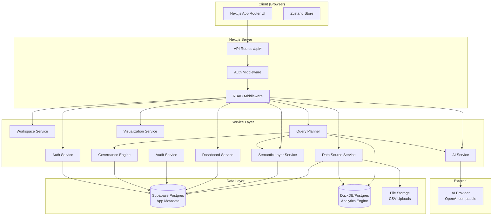
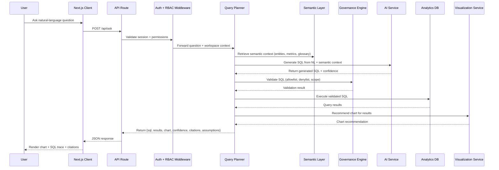
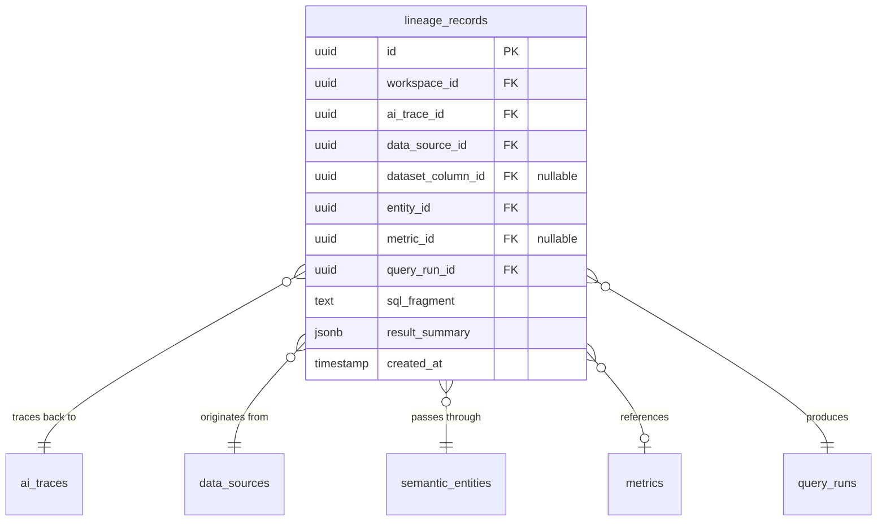

# Design Document: MetricMind MVP

## Overview

MetricMind is an AI-first business intelligence platform that enables users to connect data sources, define governed metrics through a semantic layer, explore data with dashboards, and ask natural-language questions about their data. The system provides full transparency through SQL traces, citations, confidence scores, and data lineage visualization.

### Core User Flow

```
Connect Data → Model Metrics → Ask Questions → Generate SQL → Verify Result → Render Chart → Explain Answer → Save to Dashboard
```

### Design Goals

- **AI-first**: Natural language is the primary interface for data exploration
- **Governed**: All metrics are centrally defined, certified, and enforced
- **Transparent**: Every AI answer includes SQL, citations, confidence, and assumptions
- **Secure**: Multi-tenant isolation via RLS, RBAC, SQL validation, and audit logging
- **Extensible**: Provider abstraction for AI, pluggable data sources, modular architecture

### Tech Stack

| Layer | Technology |
|-------|-----------|
| Frontend | Next.js App Router, React, TypeScript, Tailwind CSS, shadcn/ui |
| State Management | Zustand |
| Forms & Validation | React Hook Form, Zod |
| Charts | Recharts |
| Graph Visualization | React Flow |
| Auth | Supabase Auth |
| Database | Supabase Postgres (app metadata), DuckDB/Postgres (analytics queries) |
| Security | Supabase RLS, custom RBAC middleware |
| AI | OpenAI-compatible provider abstraction, server-side only |
| Testing | Vitest, property-based testing with fast-check |

---

## Architecture

### High-Level System Architecture



### Request Flow



### Layered Architecture

| Layer | Responsibility | Key Modules |
|-------|---------------|-------------|
| Application | Auth, routing, UI, workspace management | Auth pages, Dashboard pages, Ask interface |
| Data Connection | Source registration, CSV parsing, metadata introspection | Data Source Service, CSV Parser |
| Semantic | Business meaning, metrics, joins, glossary | Semantic Layer Service |
| Query Planning | NL→SQL pipeline, validation, execution | Query Planner, Governance Engine |
| Visualization | Chart recommendation, rendering, dashboards | Visualization Service, Dashboard Service |
| AI Governance | Prompts, traces, citations, confidence, hallucination prevention | AI Service, Governance Engine |
| Security & Tenancy | Isolation, RBAC, RLS, audit | RBAC Service, RLS Policies, Audit Service |

---

## Components and Interfaces

### 1. Auth Module

```typescript
// lib/auth/auth-service.ts
interface AuthService {
  signUp(email: string, password: string): Promise<AuthResult>;
  signIn(email: string, password: string): Promise<AuthResult>;
  signOut(): Promise<void>;
  getSession(): Promise<Session | null>;
  requireAuth(request: NextRequest): Promise<Session>;
}

interface AuthResult {
  user: User | null;
  error: AuthError | null;
}

// middleware.ts - Next.js middleware for route protection
export function middleware(request: NextRequest): NextResponse;
```

### 2. Workspace Service

```typescript
// lib/workspaces/workspace-service.ts
interface WorkspaceService {
  create(name: string, userId: string): Promise<Workspace>;
  getByUser(userId: string): Promise<Workspace[]>;
  inviteMember(workspaceId: string, email: string, role: Role): Promise<Membership>;
  updateMemberRole(workspaceId: string, memberId: string, role: Role): Promise<Membership>;
  removeMember(workspaceId: string, memberId: string): Promise<void>;
  transferOwnership(workspaceId: string, newOwnerId: string): Promise<void>;
}

type Role = 'owner' | 'admin' | 'analyst' | 'viewer';

interface Workspace {
  id: string;
  name: string;
  created_at: string;
  owner_id: string;
}

interface Membership {
  id: string;
  workspace_id: string;
  user_id: string;
  role: Role;
  invited_at: string;
}
```

### 3. Data Source Service

```typescript
// lib/data-sources/data-source-service.ts
interface DataSourceService {
  uploadCSV(workspaceId: string, file: File): Promise<DataSource>;
  getDataSources(workspaceId: string): Promise<DataSource[]>;
  getDataSource(id: string): Promise<DataSource>;
  loadDemoDataset(workspaceId: string): Promise<DataSource[]>;
  getColumns(dataSourceId: string): Promise<ColumnMetadata[]>;
}

interface DataSource {
  id: string;
  workspace_id: string;
  name: string;
  type: 'csv' | 'demo';
  status: 'processing' | 'ready' | 'error';
  row_count: number | null;
  file_size_bytes: number | null;
  created_at: string;
}

interface ColumnMetadata {
  name: string;
  data_type: 'text' | 'integer' | 'float' | 'boolean' | 'date' | 'timestamp';
  nullable: boolean;
  suggested_semantic_type: 'dimension' | 'measure' | null;
}
```

### 4. CSV Parser

```typescript
// lib/data-sources/csv-parser.ts
interface CSVParser {
  parse(file: Buffer, options?: ParseOptions): Promise<ParseResult>;
  inferTypes(sample: string[][]): ColumnTypeInference[];
}

interface ParseOptions {
  maxRows?: number;
  delimiter?: string;
  hasHeader?: boolean;
}

interface ParseResult {
  columns: ColumnMetadata[];
  rowCount: number;
  skippedRows: number;
  data: Record<string, unknown>[];
}

interface ColumnTypeInference {
  columnName: string;
  inferredType: string;
  confidence: number;
  sampleValues: string[];
}
```

### 5. Semantic Layer Service

```typescript
// lib/semantic/semantic-layer-service.ts
interface SemanticLayerService {
  // Entities
  createEntity(workspaceId: string, input: CreateEntityInput): Promise<SemanticEntity>;
  getEntities(workspaceId: string): Promise<SemanticEntity[]>;
  getEntity(id: string): Promise<SemanticEntity>;
  
  // Dimensions & Measures
  addDimension(entityId: string, input: CreateDimensionInput): Promise<Dimension>;
  addMeasure(entityId: string, input: CreateMeasureInput): Promise<Measure>;
  
  // Joins
  createJoin(workspaceId: string, input: CreateJoinInput): Promise<JoinRelationship>;
  validateJoin(input: CreateJoinInput): Promise<ValidationResult>;
  
  // Metrics
  createMetric(workspaceId: string, input: CreateMetricInput): Promise<Metric>;
  certifyMetric(metricId: string, userId: string): Promise<Metric>;
  getMetrics(workspaceId: string): Promise<Metric[]>;
  
  // Glossary
  createGlossaryTerm(workspaceId: string, input: CreateGlossaryInput): Promise<GlossaryTerm>;
  getGlossaryTerms(workspaceId: string): Promise<GlossaryTerm[]>;
  resolveTerms(workspaceId: string, terms: string[]): Promise<ResolvedTerm[]>;
  
  // Suggestions
  suggestSemanticTypes(columns: ColumnMetadata[]): SemanticTypeSuggestion[];
}
```

### 6. Query Planner

```typescript
// lib/query/query-planner.ts
interface QueryPlanner {
  processQuestion(input: QuestionInput): Promise<QueryResult>;
  executeSQL(workspaceId: string, sql: string): Promise<ExecutionResult>;
}

interface QuestionInput {
  question: string;
  workspaceId: string;
  userId: string;
  conversationId?: string;
}

interface QueryResult {
  sql: string;
  results: Record<string, unknown>[];
  rowCount: number;
  executionTimeMs: number;
  confidence: number;
  citations: Citation[];
  assumptions: string[];
  chartRecommendation: ChartRecommendation;
  aiTrace: AITrace;
}

interface ExecutionResult {
  rows: Record<string, unknown>[];
  rowCount: number;
  executionTimeMs: number;
  columns: { name: string; type: string }[];
}
```

### 7. AI Service

```typescript
// lib/ai/ai-service.ts
interface AIService {
  generateSQL(input: SQLGenerationInput): Promise<SQLGenerationResult>;
  generateSummary(input: SummaryInput): Promise<SummaryResult>;
  chat(input: ChatInput): Promise<ChatResult>;
}

interface SQLGenerationInput {
  question: string;
  semanticContext: SemanticContext;
  conversationHistory?: Message[];
  workspaceId: string;
}

interface SQLGenerationResult {
  sql: string;
  confidence: number;
  citations: Citation[];
  assumptions: string[];
  trace: AITrace;
}

interface AITrace {
  id: string;
  promptTemplate: string;
  fullPrompt: string;
  rawResponse: string;
  durationMs: number;
  tokenCount: { input: number; output: number };
  model: string;
  timestamp: string;
}

// lib/ai/provider.ts
interface AIProvider {
  complete(messages: Message[], options?: CompletionOptions): Promise<CompletionResult>;
}

interface AIProviderConfig {
  endpoint: string;
  model: string;
  apiKey: string; // stored encrypted, never sent to client
}
```

### 8. Governance Engine

```typescript
// lib/governance/governance-engine.ts
interface GovernanceEngine {
  validateSQL(sql: string, context: GovernanceContext): Promise<ValidationResult>;
  checkMetricReferences(sql: string, workspaceId: string): Promise<MetricValidation>;
  flagHallucination(response: AIResponse, workspaceId: string): Promise<HallucinationCheck>;
}

interface GovernanceContext {
  workspaceId: string;
  allowedTables: string[];
  allowedColumns: string[];
  denyPatterns: RegExp[];
}

interface ValidationResult {
  valid: boolean;
  errors: ValidationError[];
  warnings: ValidationWarning[];
}

interface MetricValidation {
  valid: boolean;
  referencedMetrics: string[];
  unverifiedMetrics: string[];
}
```

### 9. Visualization Service

```typescript
// lib/visualization/visualization-service.ts
interface VisualizationService {
  recommendChart(data: QueryResultData): ChartRecommendation;
  getChartConfig(recommendation: ChartRecommendation, data: QueryResultData): ChartConfig;
}

interface ChartRecommendation {
  type: 'line' | 'bar' | 'pie' | 'kpi' | 'table' | 'area' | 'scatter';
  reason: string;
  axes: { x?: string; y?: string; series?: string };
}

interface ChartConfig {
  type: string;
  data: unknown[];
  xAxis: AxisConfig;
  yAxis: AxisConfig;
  series: SeriesConfig[];
  legend: boolean;
  title?: string;
}

type QueryResultData = {
  columns: { name: string; type: string }[];
  rows: Record<string, unknown>[];
  rowCount: number;
};
```

### 10. Dashboard Service

```typescript
// lib/dashboards/dashboard-service.ts
interface DashboardService {
  create(workspaceId: string, input: CreateDashboardInput): Promise<Dashboard>;
  getDashboards(workspaceId: string): Promise<Dashboard[]>;
  getDashboard(id: string): Promise<Dashboard>;
  addWidget(dashboardId: string, widget: CreateWidgetInput): Promise<Widget>;
  updateLayout(dashboardId: string, layout: LayoutUpdate[]): Promise<void>;
  saveInsight(dashboardId: string, insight: InsightInput): Promise<Widget>;
}

interface Dashboard {
  id: string;
  workspace_id: string;
  name: string;
  description: string | null;
  created_by: string;
  created_at: string;
  widgets: Widget[];
}

interface Widget {
  id: string;
  dashboard_id: string;
  type: 'chart' | 'insight_card' | 'kpi';
  config: ChartConfig | InsightCardConfig;
  position: { x: number; y: number; w: number; h: number };
}

interface InsightCardConfig {
  question: string;
  sql: string;
  resultData: unknown[];
  chartConfig: ChartConfig;
  summary: string;
  citations: Citation[];
  confidence: number;
  assumptions: string[];
}
```

### 11. Audit Service

```typescript
// lib/audit/audit-service.ts
interface AuditService {
  log(event: AuditEvent): Promise<void>;
  getEvents(workspaceId: string, filters?: AuditFilters): Promise<AuditEvent[]>;
}

interface AuditEvent {
  id: string;
  workspace_id: string;
  actor_id: string;
  action: AuditAction;
  target_type: string;
  target_id: string;
  metadata: Record<string, unknown>;
  timestamp: string;
}

type AuditAction =
  | 'user.login'
  | 'user.logout'
  | 'member.invited'
  | 'member.removed'
  | 'member.role_changed'
  | 'datasource.created'
  | 'metric.created'
  | 'metric.certified'
  | 'metric.modified'
  | 'query.executed'
  | 'query.rejected'
  | 'alert.fired'
  | 'security.violation';
```

### 12. Alert Service

```typescript
// lib/alerts/alert-service.ts
interface AlertService {
  createAlert(workspaceId: string, input: CreateAlertInput): Promise<Alert>;
  getAlerts(workspaceId: string): Promise<Alert[]>;
  checkAlerts(workspaceId: string): Promise<FiredAlert[]>;
}

interface Alert {
  id: string;
  workspace_id: string;
  metric_id: string;
  condition_type: 'threshold_above' | 'threshold_below' | 'anomaly';
  threshold_value: number | null;
  notification_type: 'in_app';
  created_by: string;
  enabled: boolean;
}

interface FiredAlert {
  alert_id: string;
  metric_value: number;
  threshold: number;
  fired_at: string;
}
```

---

## Data Models

### Entity Relationship Diagram

```mermaid
erDiagram
    profiles ||--o{ workspace_members : "has memberships"
    workspaces ||--o{ workspace_members : "has members"
    workspaces ||--o{ data_sources : "contains"
    workspaces ||--o{ semantic_entities : "contains"
    workspaces ||--o{ metrics : "contains"
    workspaces ||--o{ glossary_terms : "contains"
    workspaces ||--o{ dashboards : "contains"
    workspaces ||--o{ conversations : "contains"
    workspaces ||--o{ alerts : "contains"
    workspaces ||--o{ audit_events : "logs"
    
    data_sources ||--o{ dataset_columns : "has columns"
    data_sources ||--o{ semantic_entities : "sourced from"
    
    semantic_entities ||--o{ dimensions : "has"
    semantic_entities ||--o{ measures : "has"
    semantic_entities ||--o{ join_relationships : "source"
    semantic_entities ||--o{ join_relationships : "target"
    
    metrics ||--o{ metric_measures : "references"
    metrics ||--o{ metric_dimensions : "uses"
    
    dashboards ||--o{ widgets : "contains"
    
    conversations ||--o{ messages : "contains"
    messages ||--o{ ai_traces : "has trace"
    messages ||--o{ query_runs : "has run"
    
    alerts ||--o{ alert_notifications : "fires"

    profiles {
        uuid id PK
        uuid auth_user_id FK
        string display_name
        string avatar_url
        timestamp created_at
    }

    workspaces {
        uuid id PK
        string name
        uuid owner_id FK
        jsonb settings
        timestamp created_at
    }

    workspace_members {
        uuid id PK
        uuid workspace_id FK
        uuid user_id FK
        enum role
        timestamp invited_at
    }

    data_sources {
        uuid id PK
        uuid workspace_id FK
        string name
        enum type
        enum status
        integer row_count
        integer file_size_bytes
        string storage_path
        timestamp created_at
    }

    dataset_columns {
        uuid id PK
        uuid data_source_id FK
        string name
        enum data_type
        boolean nullable
        enum suggested_semantic_type
        integer ordinal_position
    }

    semantic_entities {
        uuid id PK
        uuid workspace_id FK
        uuid data_source_id FK
        string name
        text description
        timestamp created_at
    }

    dimensions {
        uuid id PK
        uuid entity_id FK
        string name
        text description
        enum data_type
        string source_column
    }

    measures {
        uuid id PK
        uuid entity_id FK
        string name
        text description
        enum data_type
        string source_column
        enum default_aggregation
    }

    join_relationships {
        uuid id PK
        uuid workspace_id FK
        uuid source_entity_id FK
        uuid target_entity_id FK
        enum join_type
        string source_column
        string target_column
    }

    metrics {
        uuid id PK
        uuid workspace_id FK
        string name
        text description
        text formula
        boolean certified
        uuid certified_by
        timestamp certified_at
        timestamp created_at
        uuid created_by
    }

    glossary_terms {
        uuid id PK
        uuid workspace_id FK
        string name
        text definition
        uuid[] related_metric_ids
        uuid[] related_entity_ids
        timestamp created_at
    }

    dashboards {
        uuid id PK
        uuid workspace_id FK
        string name
        text description
        uuid created_by
        timestamp created_at
    }

    widgets {
        uuid id PK
        uuid dashboard_id FK
        enum type
        jsonb config
        integer pos_x
        integer pos_y
        integer width
        integer height
    }

    conversations {
        uuid id PK
        uuid workspace_id FK
        uuid user_id FK
        string title
        timestamp created_at
        timestamp updated_at
    }

    messages {
        uuid id PK
        uuid conversation_id FK
        enum role
        text content
        jsonb metadata
        timestamp created_at
    }

    ai_traces {
        uuid id PK
        uuid message_id FK
        uuid workspace_id FK
        text prompt_template
        text full_prompt
        text raw_response
        integer duration_ms
        integer input_tokens
        integer output_tokens
        string model
        float confidence_score
        jsonb citations
        jsonb assumptions
        timestamp created_at
    }

    query_runs {
        uuid id PK
        uuid message_id FK
        uuid workspace_id FK
        text sql
        enum status
        integer execution_time_ms
        integer row_count
        jsonb result_sample
        text error_message
        timestamp created_at
    }

    alerts {
        uuid id PK
        uuid workspace_id FK
        uuid metric_id FK
        enum condition_type
        float threshold_value
        enum notification_type
        uuid created_by
        boolean enabled
        timestamp created_at
    }

    alert_notifications {
        uuid id PK
        uuid alert_id FK
        uuid workspace_id FK
        float metric_value
        float threshold
        boolean read
        timestamp fired_at
    }

    audit_events {
        uuid id PK
        uuid workspace_id FK
        uuid actor_id FK
        enum action
        string target_type
        uuid target_id
        jsonb metadata
        timestamp created_at
    }

    sql_policies {
        uuid id PK
        uuid workspace_id FK
        enum policy_type
        text pattern
        text description
        boolean enabled
    }

    ai_provider_configs {
        uuid id PK
        uuid workspace_id FK
        string endpoint_url
        string model_name
        text encrypted_api_key
        timestamp created_at
    }
```



### Key Database Design Decisions

1. **UUID primary keys**: All tables use UUIDs for globally unique, non-sequential identifiers
2. **workspace_id on every tenant table**: Enables RLS policies to filter by workspace
3. **JSONB for flexible configs**: Widget configs, message metadata, and audit metadata use JSONB for schema flexibility
4. **Separate ai_traces table**: Decouples AI observability from message content for independent querying
5. **query_runs table**: Stores execution history for performance monitoring and audit
6. **sql_policies table**: Configurable allowlist/denylist patterns per workspace

### RLS Policy Pattern

Every workspace-scoped table follows this RLS pattern:

```sql
-- Enable RLS
ALTER TABLE table_name ENABLE ROW LEVEL SECURITY;

-- Policy: Users can only access rows in their workspace
CREATE POLICY "workspace_isolation" ON table_name
  FOR ALL
  USING (
    workspace_id IN (
      SELECT workspace_id FROM workspace_members
      WHERE user_id = auth.uid()
    )
  );
```

### Supabase Migration Structure

```
supabase/migrations/
├── 00001_create_profiles.sql
├── 00002_create_workspaces.sql
├── 00003_create_workspace_members.sql
├── 00004_create_data_sources.sql
├── 00005_create_dataset_columns.sql
├── 00006_create_semantic_entities.sql
├── 00007_create_dimensions_measures.sql
├── 00008_create_join_relationships.sql
├── 00009_create_metrics.sql
├── 00010_create_glossary_terms.sql
├── 00011_create_dashboards_widgets.sql
├── 00012_create_conversations_messages.sql
├── 00013_create_ai_traces.sql
├── 00014_create_query_runs.sql
├── 00015_create_alerts.sql
├── 00016_create_audit_events.sql
├── 00017_create_sql_policies.sql
├── 00018_create_ai_provider_configs.sql
├── 00019_enable_rls_all_tables.sql
├── 00020_create_rls_policies.sql
├── 00021_seed_demo_dataset.sql
```


---

## Data Lineage

### Lineage Service Interface

```typescript
// lib/lineage/lineage-service.ts
interface LineageService {
  buildLineageGraph(traceId: string, workspaceId: string): Promise<LineageGraph>;
  getLineageForInsight(messageId: string): Promise<LineageGraph>;
  getNodeDetails(nodeId: string, nodeType: LineageNodeType): Promise<LineageNodeDetails>;
}

type LineageNodeType = 'data_source' | 'dataset' | 'entity' | 'metric' | 'sql_query' | 'result';

interface LineageGraph {
  nodes: LineageNode[];
  edges: LineageEdge[];
}

interface LineageNode {
  id: string;
  type: LineageNodeType;
  label: string;
  metadata: Record<string, unknown>;
}

interface LineageEdge {
  id: string;
  source: string;
  target: string;
  label?: string;
}

interface LineageNodeDetails {
  id: string;
  type: LineageNodeType;
  label: string;
  // Type-specific detail payloads
  dataSource?: { name: string; type: string; rowCount: number };
  entity?: { name: string; description: string; dimensions: string[]; measures: string[] };
  metric?: { name: string; formula: string; certified: boolean; certifiedBy?: string };
  sqlQuery?: { sql: string; executionTimeMs: number };
  result?: { rowCount: number; columns: string[] };
}
```

### Lineage Data Model



The `lineage_records` table stores the full derivation chain for each AI trace:

| Column | Purpose |
|--------|---------|
| `ai_trace_id` | Links to the AI trace that produced this lineage |
| `data_source_id` | The originating data source |
| `dataset_column_id` | Optional specific column referenced |
| `entity_id` | The semantic entity used in the query |
| `metric_id` | The metric definition applied (nullable for raw queries) |
| `query_run_id` | The executed SQL query and its results |
| `sql_fragment` | The relevant SQL fragment for this lineage path |
| `result_summary` | JSONB summary of the result produced by this path |

### Visualization Note

The directed graph visualization uses **React Flow** to render the lineage DAG. Each node type has a distinct visual style (color, icon) and clicking a node opens a detail panel via `getNodeDetails()`. The layout uses a left-to-right dagre algorithm to clearly show the data flow: data_source → dataset → entity → metric → sql_query → result.

---

## Route Structure

### Next.js App Router File Layout

```
app/
├── (public)/
│   ├── page.tsx                    # Landing page (/)
│   ├── login/page.tsx              # Login (/login)
│   ├── signup/page.tsx             # Signup (/signup)
│   └── demo/page.tsx               # Demo (/demo)
├── (protected)/
│   └── app/
│       ├── layout.tsx              # Authenticated shell (sidebar, topbar)
│       ├── page.tsx                # Workspace home / redirect
│       ├── workspaces/
│       │   ├── page.tsx            # Workspace list
│       │   └── [workspaceId]/
│       │       └── page.tsx        # Workspace overview
│       ├── settings/page.tsx       # Workspace settings
│       ├── data-sources/
│       │   ├── page.tsx            # Data source list
│       │   └── [id]/page.tsx       # Data source detail
│       ├── semantic-layer/
│       │   ├── entities/
│       │   │   ├── page.tsx        # Entity list
│       │   │   └── [id]/page.tsx   # Entity detail / editor
│       │   ├── metrics/
│       │   │   ├── page.tsx        # Metric list
│       │   │   └── [id]/page.tsx   # Metric detail / editor
│       │   └── glossary/page.tsx   # Glossary terms
│       ├── explore/page.tsx        # Data exploration
│       ├── ask/
│       │   ├── page.tsx            # New conversation
│       │   └── [conversationId]/page.tsx  # Existing conversation
│       ├── dashboards/
│       │   ├── page.tsx            # Dashboard list
│       │   └── [id]/page.tsx       # Dashboard view / edit
│       ├── insights/page.tsx       # Saved insights
│       ├── alerts/page.tsx         # Alert management
│       └── audit-logs/page.tsx     # Audit log viewer
├── api/
│   └── ...                         # API route handlers
└── layout.tsx                      # Root layout
```

### Public Routes

| Route | Purpose |
|-------|---------|
| `/` | Landing page with hero, feature cards, and CTAs |
| `/login` | Email/password login form |
| `/signup` | Registration form |
| `/demo` | Pre-loaded demo workspace (no auth required) |

### Protected Routes (under `/app`)

All routes under `(protected)/app/` require an authenticated session. The Next.js middleware redirects unauthenticated users to `/login`.

| Route | Purpose | Min Role |
|-------|---------|----------|
| `/app/workspaces` | Workspace list and switcher | viewer |
| `/app/settings` | Workspace settings, members, AI config | owner |
| `/app/data-sources` | Data source management | analyst |
| `/app/semantic-layer/entities` | Entity CRUD | analyst |
| `/app/semantic-layer/metrics` | Metric CRUD and certification | analyst |
| `/app/semantic-layer/glossary` | Glossary term management | admin |
| `/app/explore` | Ad-hoc data exploration | analyst |
| `/app/ask` | Natural-language question interface | viewer |
| `/app/dashboards` | Dashboard list and management | viewer (read), analyst (write) |
| `/app/insights` | Saved insight cards | viewer |
| `/app/alerts` | Alert configuration | analyst |
| `/app/audit-logs` | Audit event viewer | admin |

### Landing Page Component Structure

```typescript
// app/(public)/page.tsx
export default function LandingPage() {
  return (
    <>
      <HeroSection />
      <FeatureCards />
      <HowItWorksSection />
      <CTASection />
      <Footer />
    </>
  );
}

// Components breakdown:
// HeroSection: Tagline "Ask your data. Trust the answer.", subtitle, primary CTA (Sign Up), secondary CTA (Try Demo)
// FeatureCards: Grid of 4-6 cards highlighting core capabilities (NL Questions, Governed Metrics, AI Transparency, Dashboards)
// HowItWorksSection: 4-step visual flow (Connect → Model → Ask → Insight)
// CTASection: Final call-to-action with signup and demo buttons
// Footer: Links, legal, social
```

---

## RBAC Middleware Interface

### Role Hierarchy

```
owner > admin > analyst > viewer
```

Each role inherits all permissions of the roles below it.

### Middleware Interface

```typescript
// lib/rbac/rbac-middleware.ts
import { NextRequest, NextResponse } from 'next/server';

type Role = 'owner' | 'admin' | 'analyst' | 'viewer';

interface RBACContext {
  userId: string;
  workspaceId: string;
  role: Role;
}

interface RBACMiddlewareOptions {
  requiredRole: Role;
}

/**
 * RBAC middleware that checks workspace membership and role
 * before allowing API route handlers to proceed.
 *
 * Usage:
 *   export const POST = withRBAC({ requiredRole: 'analyst' }, handler);
 */
function withRBAC(
  options: RBACMiddlewareOptions,
  handler: (req: NextRequest, context: RBACContext) => Promise<NextResponse>
): (req: NextRequest) => Promise<NextResponse>;

/**
 * Checks if the given role meets or exceeds the required role
 * based on the hierarchy: owner > admin > analyst > viewer
 */
function hasPermission(userRole: Role, requiredRole: Role): boolean;

/**
 * Resolves the user's role within a specific workspace.
 * Returns null if the user is not a member of the workspace.
 */
function resolveWorkspaceRole(userId: string, workspaceId: string): Promise<Role | null>;
```

### Role Permission Matrix

| Action | Owner | Admin | Analyst | Viewer |
|--------|-------|-------|---------|--------|
| Manage workspace settings | ✓ | — | — | — |
| Transfer ownership | ✓ | — | — | — |
| Invite/remove members | ✓ | ✓ | — | — |
| Manage data sources | ✓ | ✓ | ✓ | — |
| Manage semantic layer | ✓ | ✓ | ✓ | — |
| Certify metrics | ✓ | ✓ | — | — |
| Manage glossary | ✓ | ✓ | — | — |
| Create/edit dashboards | ✓ | ✓ | ✓ | — |
| Ask questions | ✓ | ✓ | ✓ | ✓ |
| View dashboards | ✓ | ✓ | ✓ | ✓ |
| Configure alerts | ✓ | ✓ | ✓ | — |
| View audit logs | ✓ | ✓ | — | — |

---

## Mock AI Provider

### Design

The `MockAIProvider` implements the `AIProvider` interface and returns deterministic responses with realistic structure for local development without requiring an AI API key.

```typescript
// lib/ai/mock-provider.ts
import { AIProvider, Message, CompletionOptions, CompletionResult } from './provider';

interface MockResponseTemplate {
  sql: string;
  confidence: number;
  citations: MockCitation[];
  assumptions: string[];
  summary: string;
}

interface MockCitation {
  type: 'metric' | 'entity' | 'data_source';
  name: string;
  id: string;
}

class MockAIProvider implements AIProvider {
  private templates: Map<string, MockResponseTemplate>;

  constructor() {
    this.templates = this.loadDefaultTemplates();
  }

  /**
   * Returns a deterministic completion based on keyword matching
   * against the input messages. Responses include realistic SQL,
   * confidence scores, citations, and assumptions.
   */
  async complete(messages: Message[], options?: CompletionOptions): Promise<CompletionResult> {
    const lastMessage = messages[messages.length - 1];
    const template = this.matchTemplate(lastMessage.content);

    return {
      content: JSON.stringify({
        sql: template.sql,
        confidence: template.confidence,
        citations: template.citations,
        assumptions: template.assumptions,
        summary: template.summary,
      }),
      usage: {
        inputTokens: this.estimateTokens(messages),
        outputTokens: 150,
      },
      model: 'mock-v1',
      durationMs: 50 + Math.random() * 100, // Simulate slight latency
    };
  }

  /**
   * Matches user question keywords to a pre-defined response template.
   * Falls back to a generic template if no keyword match is found.
   */
  private matchTemplate(content: string): MockResponseTemplate;

  /**
   * Loads default templates covering common demo scenarios:
   * - Revenue queries (MRR, ARR, growth)
   * - Customer queries (churn, retention, cohorts)
   * - Product queries (active users, feature usage)
   * - Aggregation queries (counts, averages, sums)
   */
  private loadDefaultTemplates(): Map<string, MockResponseTemplate>;

  private estimateTokens(messages: Message[]): number;
}
```

### Activation

The `MockAIProvider` is automatically used when:
1. No `AI_PROVIDER_API_KEY` environment variable is set, OR
2. The workspace's `ai_provider_configs` record has no `encrypted_api_key`

This allows developers to run the full application locally and exercise the complete NL→SQL→Chart pipeline with realistic (but deterministic) responses.

---

## Profile Auto-Creation

### Design

When a new user signs up via Supabase Auth, a database trigger automatically creates a corresponding record in the `profiles` table. This ensures every authenticated user has a profile without requiring application-level orchestration.

### Implementation: Supabase Database Trigger

```sql
-- Migration: 00022_create_profile_trigger.sql

-- Function that creates a profile when a new auth user is created
CREATE OR REPLACE FUNCTION public.handle_new_user()
RETURNS TRIGGER AS $$
BEGIN
  INSERT INTO public.profiles (id, auth_user_id, display_name, avatar_url, created_at)
  VALUES (
    gen_random_uuid(),
    NEW.id,
    COALESCE(NEW.raw_user_meta_data->>'display_name', split_part(NEW.email, '@', 1)),
    NEW.raw_user_meta_data->>'avatar_url',
    NOW()
  );
  RETURN NEW;
END;
$$ LANGUAGE plpgsql SECURITY DEFINER;

-- Trigger on auth.users insert
CREATE TRIGGER on_auth_user_created
  AFTER INSERT ON auth.users
  FOR EACH ROW
  EXECUTE FUNCTION public.handle_new_user();
```

### Behavior

| Scenario | Result |
|----------|--------|
| User signs up with email/password | Profile created with email prefix as `display_name` |
| User signs up with metadata (e.g., display_name) | Profile created with provided `display_name` |
| User signs up with avatar URL in metadata | Profile created with `avatar_url` populated |
| Trigger fails (e.g., unique constraint) | Auth user creation still succeeds; profile can be created on first app access as fallback |

### Fallback

If the trigger fails for any reason, the application layer checks for a profile on first authenticated request and creates one if missing:

```typescript
// lib/auth/ensure-profile.ts
async function ensureProfile(userId: string, email: string): Promise<Profile> {
  const existing = await getProfileByAuthId(userId);
  if (existing) return existing;

  return createProfile({
    authUserId: userId,
    displayName: email.split('@')[0],
  });
}
```

---

## Zustand Store Design

### Store Architecture

The client-side state is managed by Zustand with separate slices for each domain concern. Each store is independent and can be composed as needed by components.

### `useAuthStore`

```typescript
// stores/auth-store.ts
interface AuthState {
  user: User | null;
  session: Session | null;
  workspaceContext: { workspaceId: string; role: Role } | null;
  isLoading: boolean;

  // Actions
  setUser: (user: User | null) => void;
  setSession: (session: Session | null) => void;
  setWorkspaceContext: (ctx: { workspaceId: string; role: Role } | null) => void;
  signOut: () => void;
}
```

### `useWorkspaceStore`

```typescript
// stores/workspace-store.ts
interface WorkspaceState {
  activeWorkspace: Workspace | null;
  members: Membership[];
  currentUserRole: Role | null;
  isLoading: boolean;

  // Actions
  setActiveWorkspace: (workspace: Workspace) => void;
  setMembers: (members: Membership[]) => void;
  addMember: (member: Membership) => void;
  removeMember: (memberId: string) => void;
  updateMemberRole: (memberId: string, role: Role) => void;
}
```

### `useConversationStore`

```typescript
// stores/conversation-store.ts
interface ConversationState {
  currentConversationId: string | null;
  messages: Message[];
  isLoading: boolean;
  isStreaming: boolean;
  error: string | null;

  // Actions
  setConversation: (id: string, messages: Message[]) => void;
  addMessage: (message: Message) => void;
  updateMessage: (id: string, updates: Partial<Message>) => void;
  setLoading: (loading: boolean) => void;
  setStreaming: (streaming: boolean) => void;
  setError: (error: string | null) => void;
  reset: () => void;
}
```

### `useDashboardStore`

```typescript
// stores/dashboard-store.ts
interface DashboardState {
  activeDashboard: Dashboard | null;
  widgets: Widget[];
  isEditing: boolean;
  pendingLayoutChanges: LayoutUpdate[];

  // Actions
  setActiveDashboard: (dashboard: Dashboard) => void;
  setWidgets: (widgets: Widget[]) => void;
  addWidget: (widget: Widget) => void;
  removeWidget: (widgetId: string) => void;
  updateWidgetPosition: (widgetId: string, position: { x: number; y: number; w: number; h: number }) => void;
  setEditing: (editing: boolean) => void;
  commitLayout: () => Promise<void>;
  discardChanges: () => void;
}
```

### Store Conventions

- **No server state caching**: Zustand stores hold UI state and transient data. Server data is fetched fresh via API calls (or React Query if added later).
- **Minimal persistence**: Only `workspaceContext` in `useAuthStore` is persisted to `localStorage` (via Zustand `persist` middleware) so the active workspace survives page refreshes.
- **Type safety**: All stores use TypeScript interfaces and Zod validation for any data entering the store from external sources.
- **Devtools**: All stores are wrapped with `devtools` middleware in development for debugging.
