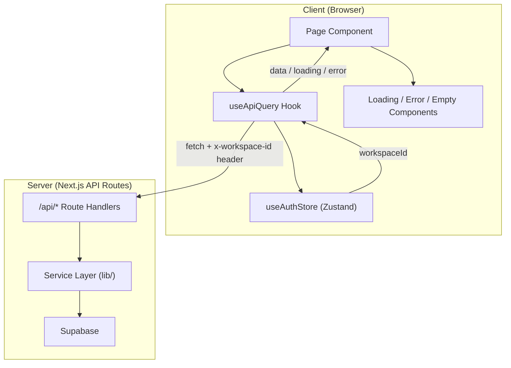

# Design Document: Wire Up Backend

## Overview

This design replaces hardcoded mock data in MetricMind's frontend pages with live API calls to existing backend routes. The core approach is a shared `useApiQuery` hook that encapsulates the fetch-with-workspace-header pattern already used in the Alerts page, plus reusable loading/error/empty state components. Each page will be updated to use this hook (or a page-specific variant) to fetch from the correct endpoints.

The design prioritizes:
- **Consistency**: One hook pattern, one error shape, one loading skeleton approach
- **Minimal new dependencies**: Plain `fetch` + React state (no SWR/React Query), matching existing patterns
- **Incremental migration**: Each page can be wired independently without breaking others

## Architecture



**Data flow:**
1. Page mounts → calls `useApiQuery(url, params)`
2. Hook reads `workspaceId` from `useAuthStore`
3. Hook calls `fetch(url, { headers: { 'x-workspace-id': workspaceId } })`
4. On success → returns parsed JSON data
5. On error → parses error message from response body
6. Page renders data, or delegates to Loading/Error/Empty components

## Components and Interfaces

### 1. `useApiQuery` Hook

Location: `hooks/use-api-query.ts`

```typescript
interface UseApiQueryOptions {
  /** Skip fetching (e.g., when a dependency isn't ready) */
  enabled?: boolean;
  /** Query parameters appended to the URL */
  params?: Record<string, string | undefined>;
}

interface UseApiQueryResult<T> {
  data: T | null;
  isLoading: boolean;
  error: string | null;
  refetch: () => void;
}

function useApiQuery<T>(
  url: string,
  options?: UseApiQueryOptions
): UseApiQueryResult<T>;
```

**Behavior:**
- Reads `workspaceContext.workspaceId` from `useAuthStore()`
- If `workspaceId` is falsy or `enabled === false`, stays in loading state without fetching
- Constructs URL with query params, calls `fetch` with `x-workspace-id` header
- On 2xx: parses JSON, sets `data`
- On non-2xx: parses JSON body for `message` field, sets `error`
- On network failure: sets `error` to a generic message
- `refetch()` re-triggers the fetch (for retry-on-error)
- Re-fetches when `url`, `params`, or `workspaceId` change

### 2. `useApiMutation` Hook

Location: `hooks/use-api-mutation.ts`

```typescript
interface UseApiMutationResult<TInput, TOutput> {
  mutate: (input: TInput) => Promise<TOutput | null>;
  isLoading: boolean;
  error: string | null;
}

function useApiMutation<TInput, TOutput>(
  url: string,
  method?: 'POST' | 'PUT' | 'DELETE'
): UseApiMutationResult<TInput, TOutput>;
```

**Behavior:**
- Same workspace header injection as `useApiQuery`
- Returns a `mutate` function for on-demand POST/PUT/DELETE calls
- Used by the Ask page (POST question) and Explore page (POST query)

### 3. Shared UI State Components

Location: `components/ui/api-states.tsx`

```typescript
/** Full-section loading skeleton */
function LoadingSkeleton(props: { lines?: number; className?: string }): JSX.Element;

/** Card-grid loading skeleton */
function LoadingCards(props: { count?: number; className?: string }): JSX.Element;

/** Error state with message and retry button */
function ErrorState(props: { message: string; onRetry?: () => void }): JSX.Element;

/** Empty state with icon, message, and optional action */
function EmptyState(props: {
  title: string;
  description?: string;
  action?: { label: string; onClick: () => void };
}): JSX.Element;
```

### 4. API Response Types

Location: `types/api-responses.ts`

These types mirror the shapes returned by existing API routes (derived from service layer types and current mock-data types):

```typescript
// From /api/data-sources
interface DataSourcesResponse {
  dataSources: Array<{
    id: string;
    workspace_id: string;
    name: string;
    type: string;
    status: string;
    created_at: string;
  }>;
}

// From /api/semantic/entities
interface EntitiesResponse {
  entities: Array<{
    id: string;
    workspace_id: string;
    data_source_id: string;
    name: string;
    description: string | null;
    created_at: string;
  }>;
}

// From /api/semantic/metrics
interface MetricsResponse {
  metrics: Array<{
    id: string;
    name: string;
    formula: string;
    owner: string;
    certified: boolean;
    certified_date: string | null;
  }>;
}

// From /api/semantic/joins
interface JoinsResponse {
  joins: Array<{
    id: string;
    source_entity_id: string;
    target_entity_id: string;
    join_type: string;
    condition: string;
  }>;
}

// From /api/conversations
interface ConversationsResponse {
  conversations: Array<{
    id: string;
    workspace_id: string;
    user_id: string;
    title: string | null;
    created_at: string;
    updated_at: string;
  }>;
}

// From /api/conversations/[id]/messages
interface MessagesResponse {
  messages: Array<{
    id: string;
    conversation_id: string;
    role: 'user' | 'assistant';
    content: string;
    created_at: string;
  }>;
}

// From /api/ask
interface AskResponse {
  success: boolean;
  data: {
    summary: string;
    sql: string;
    results: Record<string, unknown>[];
    metrics?: Array<{ label: string; value: string; trend: 'up' | 'down' }>;
    chartData?: Record<string, unknown>[];
    citations?: Array<{ label: string; source: string }>;
    aiTrace?: { id: string; steps: string[] };
    confidence?: number;
  };
}

// From /api/audit-logs
interface AuditLogsResponse {
  events: Array<{
    id: string;
    workspace_id: string;
    actor_id: string;
    action: string;
    target_type: string;
    target_id: string;
    metadata: Record<string, unknown>;
    created_at: string;
  }>;
}

// From /api/dashboards/[id]/insights (for executive dashboard)
interface DashboardInsightsResponse {
  kpis: Array<{ label: string; value: string; trend: 'up' | 'down' | 'neutral'; trendValue: string }>;
  revenue: Array<{ month: string; mrr: number; starter: number; growth: number; enterprise: number }>;
  planMix: Array<{ plan: string; revenue: number }>;
  weeklyActiveUsers: Array<{ week: string; current: number; previous: number }>;
  topExpansionAccounts: Array<{ name: string; expansionMrr: number; growthPercent: number; plan: string }>;
  aiInsight: { summary: string; confidence: number; link: string };
}
```

### 5. Page-to-Endpoint Mapping

| Page | Endpoint(s) | Hook Usage |
|------|-------------|------------|
| Workspace Home (`/app`) | `/api/dashboards/home` (new composite) or multiple calls | `useApiQuery` |
| Data Sources (`/app/data-sources`) | `GET /api/data-sources` | `useApiQuery` |
| Semantic Layer (`/app/semantic-layer`) | `GET /api/semantic/entities`, `/api/semantic/metrics`, `/api/semantic/joins` | Multiple `useApiQuery` |
| Ask (`/app/ask`) | `GET /api/conversations`, `GET /api/conversations/[id]/messages`, `POST /api/ask` | `useApiQuery` + `useApiMutation` |
| Explore (`/app/explore`) | `POST /api/ask` | `useApiMutation` |
| Executive Dashboard (`/app/dashboards/executive`) | `GET /api/dashboards/[id]/insights` | `useApiQuery` |
| Audit Logs (`/app/audit-logs`) | `GET /api/audit-logs` | `useApiQuery` with params |

**Note on Workspace Home:** The home page currently fetches KPIs, revenue, metrics, and trust health. If no composite endpoint exists, the page will make parallel `useApiQuery` calls to individual endpoints (e.g., `/api/dashboards/home` or `/api/semantic/metrics` + `/api/dashboards`). The simplest approach is a dedicated `/api/dashboards/home` route that aggregates this data server-side, but if that doesn't exist, the page will use multiple hook instances.

## Data Models

The data models are defined by the existing API routes and Supabase schema. The frontend types in `types/api-responses.ts` (above) are the canonical client-side representations.

**Key mapping decisions:**
- API responses use `snake_case` (matching Supabase column names)
- Frontend components may need camelCase adapters for display, but the hook returns raw API shapes
- Pages that previously used mock-data types will import from `types/api-responses.ts` instead

## Correctness Properties

*A property is a characteristic or behavior that should hold true across all valid executions of a system — essentially, a formal statement about what the system should do. Properties serve as the bridge between human-readable specifications and machine-verifiable correctness guarantees.*

### Property 1: Workspace header inclusion

*For any* URL and workspace ID passed to `useApiQuery`, the resulting `fetch` call SHALL include an `x-workspace-id` header with the exact workspace ID value.

**Validates: Requirements 8.2**

### Property 2: Error message extraction from non-2xx responses

*For any* HTTP response with a non-2xx status code and a JSON body containing a `message` field, `useApiQuery` SHALL set its error state to that message string.

**Validates: Requirements 8.4**

## Error Handling

### Hook-Level Error Handling

The `useApiQuery` hook handles errors in a layered approach:

1. **Network errors** (fetch throws): Sets `error` to `"Network error. Please check your connection and try again."`
2. **HTTP errors** (non-2xx status): Parses JSON body for `message` field. Falls back to `"Request failed with status {code}"` if parsing fails.
3. **JSON parse errors** (invalid response body): Sets `error` to `"Unexpected response format"`

### Page-Level Error Handling

Each page uses the `ErrorState` component, passing:
- `message`: from `useApiQuery.error`
- `onRetry`: bound to `useApiQuery.refetch`

### Missing Workspace Context

When `workspaceContext` is null (user hasn't selected a workspace), the hook does not fetch. Pages should show a prompt to select a workspace, matching the pattern already used in the Alerts page.

### Partial Failures (Multi-Fetch Pages)

Pages like Semantic Layer that call multiple endpoints handle partial failures by:
- Showing `ErrorState` for the failed section only
- Rendering successfully-loaded sections normally
- Each `useApiQuery` instance manages its own error state independently

## Testing Strategy

### Unit Tests (Example-Based)

Unit tests cover:
- **Hook behavior**: Correct fetch URL construction, header inclusion, state transitions (loading → data, loading → error), refetch behavior, disabled state when no workspace
- **Page rendering**: Each page tested with mocked hook responses for loading, success, error, and empty states
- **Component rendering**: `ErrorState`, `EmptyState`, `LoadingSkeleton` render correctly with various props

### Property-Based Tests

Property tests cover the two universal properties of the `useApiQuery` hook:
- **Property 1**: For any URL/workspaceId combination, the header is always included
- **Property 2**: For any non-2xx response with a JSON message, the error is correctly extracted

**Library**: `fast-check` (already compatible with the project's Jest/Vitest setup)
**Configuration**: Minimum 100 iterations per property test
**Tag format**: `Feature: wire-up-backend, Property N: {property_text}`

### Integration Tests

Integration tests verify:
- Each page calls the correct endpoint(s) on mount
- Filter changes on Audit Logs page trigger re-fetch with correct query params
- Ask page POST includes correct body structure
- Explore page constructs correct query from UI selections

### Smoke Tests

- No production page imports from `lib/mock-data/`
- Mock data files still exist for tests and demo page
