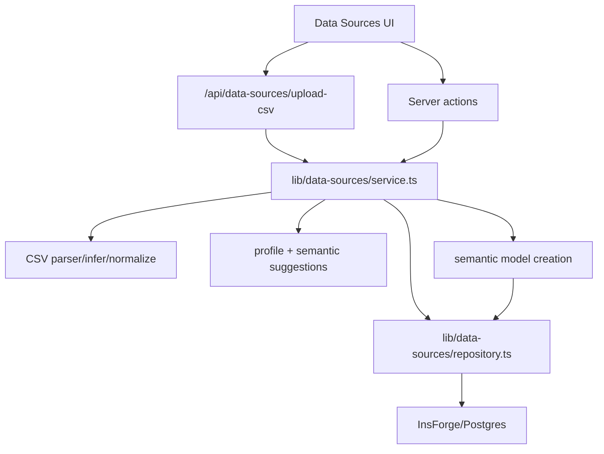

# ADR 002: Manage Data Sources Through Server-Side Lifecycle Services

## Status

Accepted.

The decision is implemented for demo sources and CSV upload. Warehouse/SaaS connectors are not implemented in this repository yet.

## Context

The Data Sources page needs more than basic CRUD. A useful source must carry dataset metadata, inferred schema, profile quality, semantic suggestions, sync history, issues, and a path into the semantic layer.

Because these operations touch workspace data and potentially sensitive source credentials, the browser should not own ingestion, profiling, persistence, or role checks.

## Decision

Data-source lifecycle work belongs in server-side services and repositories:

```text
UI or route handler
  -> server action / API route
  -> lib/data-sources/service.ts
  -> lib/data-sources/repository.ts
  -> InsForge/Postgres
```

The UI may render upload and action controls, but server code must validate auth, workspace role, file type/size, persistence, audit events, and semantic-model creation.

## Current Scope

Currently implemented:

- Demo data source creation.
- CSV upload through `app/api/data-sources/upload-csv/route.ts`.
- CSV parsing, schema inference, row normalization, profiling, and semantic suggestions.
- Dataset rows stored as JSONB in `dataset_rows`.
- Manual metadata sync records for CSV and demo sources.
- Dataset column metadata updates.
- Semantic model creation from a dataset.

Not currently implemented:

- Real Snowflake, BigQuery, Postgres, Stripe, HubSpot, Segment, Zendesk, or similar external connectors.
- Background job infrastructure for long-running syncs.
- Binary object storage for uploaded CSV files. Current code stores upload metadata and normalized rows.
- End-user credential management UI for non-CSV connectors.
- Verified encryption behavior for `data_source_credentials.encrypted_payload`. TODO: verify before claiming encrypted-at-rest credential support.

## Current Implementation

Key paths:

- `app/(protected)/app/data-sources/page.tsx`: protected route for the Data Sources page.
- `components/data-sources/data-sources-page.tsx`: client UI for page data, CSV upload, sync, column edits, and semantic-model actions.
- `app/(protected)/app/data-sources/actions.ts`: server actions for demo source creation, sync, column updates, and semantic model creation.
- `app/api/data-sources/upload-csv/route.ts`: multipart upload route for CSV files.
- `lib/data-sources/service.ts`: auth, role checks, validation, lifecycle orchestration, audit logging.
- `lib/data-sources/repository.ts`: database reads/writes and row mapping.
- `lib/data-sources/connectors/csv-connector.ts`: CSV connector implementation.
- `lib/data-sources/connectors/demo-connector.ts`: demo connector implementation.
- `lib/data-sources/csv/`: parser, schema inference, and row normalization.
- `lib/data-sources/profiling/`: profile generation, readiness score, semantic suggestions.
- `lib/data-sources/sync/sync-runner.ts`: manual metadata sync bookkeeping for implemented source types.
- `migrations/20260516090000_data-sources-backend.sql`: canonical data-source backend schema and RLS policies.

There is also an older `lib/data-sources/data-source-service.ts` used by `app/api/data-sources/route.ts`. Check the caller before editing; similar names do not mean the same flow.

## Lifecycle Flow



## Storage Model

Current data-source tables and responsibilities:

| Table | Responsibility |
| --- | --- |
| `data_sources` | Source metadata, provider/category, sync health, owner, region, metadata JSON. |
| `uploaded_files` | Metadata for uploaded files. |
| `datasets` | Dataset metadata, status, approval, quality score, semantic coverage, primary key. |
| `dataset_columns` | Physical column metadata plus semantic role/type suggestions. |
| `dataset_rows` | Normalized CSV/demo row data as JSONB for MVP querying. |
| `dataset_profiles` | Latest dataset profile, sample values, semantic suggestions, readiness score. |
| `data_source_sync_runs` | Sync run history and status. |
| `data_source_issues` | Source or dataset issues. |
| `data_source_credentials` | Isolated credential payload storage for future connector flows. |

`dataset_rows` is intentionally an MVP-friendly store for uploaded/demo rows. If the app later moves CSV data into warehouse tables, object storage, or another serving layer, update this ADR and the semantic compiler assumptions together.

## Roles And RLS

Role-sensitive behavior is split between service checks and SQL policies:

- `viewer`: can read approved/active dataset metadata and rows.
- `analyst`: can upload CSV files and insert datasets/rows/profiles.
- `admin` and `owner`: can update/delete sources and manage sync/issue records.
- Credential insert/update/delete policies are owner/admin-only.

The server must still perform explicit route/service checks. RLS is a backstop, not a replacement for clear application-level authorization and useful user-facing errors.

## Security And Privacy Notes

- Do not return `data_source_credentials` rows to the browser.
- Do not print or commit source credentials or local `.env*` values.
- CSV uploads are limited to 50 MB in `lib/data-sources/service.ts`.
- The upload route accepts `x-workspace-id`, form `workspaceId`, or query `workspaceId`; workspace membership is resolved server-side before persistence.
- Uploaded row values are persisted in `dataset_rows.data`; treat CSV content as workspace data, not transient UI-only content.
- Audit logging should not break ingestion, but repository tests should catch policy regressions.

## Consequences

Benefits:

- Ingestion behavior is testable without browser automation.
- Role and workspace checks stay near persistence.
- CSV/demo flows share the same dataset/profile/semantic-model concepts.
- Future connectors can implement the `DataSourceConnector` interface without changing the UI contract.

Trade-offs:

- JSONB row storage is simple but not a long-term high-scale analytics engine.
- Synchronous CSV processing keeps the MVP simple but is not ideal for very large files.
- The older data-source service path can cause confusion until it is consolidated or removed.

## Safe-Change Guidelines

- Keep `service.ts` responsible for lifecycle orchestration; keep `repository.ts` focused on database access and mapping.
- Add tests for auth/role changes, upload validation, repository mapping, profiling, and semantic-model creation.
- Do not add connector credentials to client state.
- When adding a real external connector, implement connection testing, schema discovery, sync semantics, credential redaction, audit events, and RLS expectations together.
- When changing table columns in migrations, update repository mappers, service types, docs, and tests in the same branch.
- Quote App Router paths in zsh when running commands against route groups, for example `'app/(protected)/app/data-sources/page.tsx'`.

## Related ADRs

- [ADR 000: Current System Boundary And Runtime Shape](000-system-design.md)
- [ADR 001: Govern Analytics Through SemanticQuery Compilation](001-semantic-layer.md)

## Open Questions

- TODO: verify the intended encryption implementation behind `data_source_credentials.encrypted_payload`.
- TODO: verify whether uploads should also persist original files in object storage.
- TODO: verify the target background-job mechanism for large syncs.
- TODO: decide whether to retire or merge `lib/data-sources/data-source-service.ts` with the newer lifecycle service.
