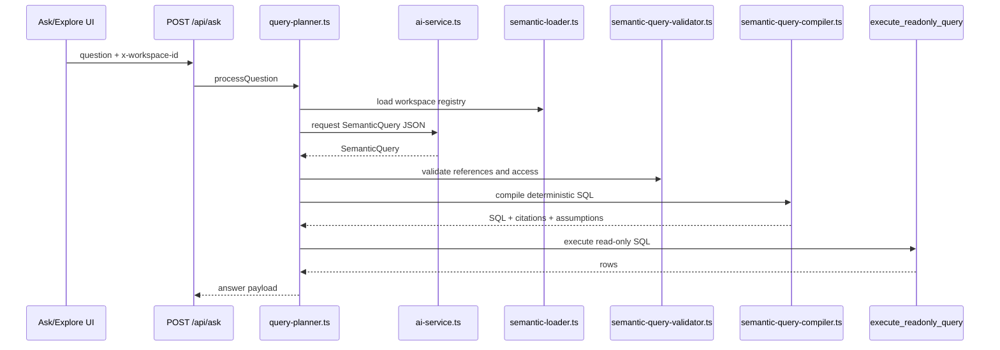

# ADR 001: Govern Analytics Through SemanticQuery Compilation

## Status

Accepted.

The core decision is implemented for the `/api/ask` query path. Some management surfaces and metadata-quality workflows are still evolving.

## Context

MetricMind is a governed BI app. Users ask business questions and expect answers based on trusted metrics, not arbitrary model-authored SQL over raw tables.

The repository already has a semantic registry, an AI provider abstraction, a query planner, a semantic validator/compiler, and a read-only SQL RPC. Future analytics work should strengthen that path rather than bypass it.

## Decision

MetricMind analytics should use this contract:

```text
question or UI intent
  -> SemanticQuery JSON
  -> semantic registry validation
  -> deterministic SQL compilation
  -> read-only SQL RPC
  -> answer payload with citations/assumptions
```

AI must not generate executable raw SQL directly for the governed ask flow. The AI service may propose `SemanticQuery` JSON only; the compiler owns SQL generation.

## Current Implementation

Key paths:

- `app/api/ask/route.ts`: route boundary for natural-language questions.
- `lib/query/query-planner.ts`: orchestrates semantic context loading, AI planning, validation, compilation, execution, and trace writes.
- `lib/ai/ai-service.ts`: prompts the provider to return `SemanticQuery` JSON.
- `lib/semantic/types.ts`: current semantic registry and `SemanticQuery` TypeScript types.
- `lib/semantic/semantic-loader.ts`: loads semantic models, entities, relationships, metrics, dimensions, measures, and glossary terms.
- `lib/semantic/semantic-query-validator.ts`: validates metric, dimension, filter, time, role, and entity compatibility.
- `lib/semantic/semantic-query-compiler.ts`: compiles accepted semantic queries into SQL.
- `lib/semantic/citation-builder.ts`: returns semantic citations for compiled queries.
- `migrations/20260515120000_semantic-layer-registry.sql`: canonical registry tables.
- `migrations/20260514080841_initial-schema.sql`: base schema and `execute_readonly_query` RPC.

Runtime shape:



## SemanticQuery Contract

The current query shape lives in `lib/semantic/types.ts`:

```ts
export interface SemanticQuery {
  metrics: string[];
  dimensions?: string[];
  time?: {
    dimension: string;
    grain: "day" | "week" | "month" | "quarter" | "year";
  };
  filters?: Array<{
    field: string;
    operator:
      | "eq"
      | "neq"
      | "gt"
      | "gte"
      | "lt"
      | "lte"
      | "in"
      | "not_in"
      | "contains"
      | "starts_with"
      | "ends_with"
      | "is_null"
      | "is_not_null";
    value?: string | number | boolean | null | Array<string | number | boolean | null>;
  }>;
  orderBy?: Array<{ field: string; direction?: "asc" | "desc" }>;
  limit?: number;
}
```

Do not document or send alternate operator names such as `"="` or `">"` unless the code changes to support them.

## Registry Model

Current registry concepts:

| Concept | Current source |
| --- | --- |
| Semantic model | `semantic_models` |
| Entity | `semantic_entities` |
| Dimension | `semantic_dimensions` |
| Measure | `semantic_measures` |
| Relationship | `semantic_relationships` |
| Metric | `metrics` |
| Glossary term | `glossary_terms` |

The current semantic model is table-oriented. `semantic_models.source_table` and `semantic_entities.source_table` are the source references used by the loader/compiler. Do not replace this with dataset-id-only documentation unless the migration and loader are changed together.

## Safety Boundaries

The semantic path has several guardrails:

- AI output is parsed as JSON and rejected if it is not a semantic query.
- Requested metrics and dimensions must exist in the loaded registry.
- Metrics in a query must share a compatible root entity.
- PII dimensions require the configured `requiredRole`.
- The compiler validates semantic expressions and rejects unsafe expressions.
- Query limits are capped by compiler options.
- `execute_readonly_query` rejects non-read-only SQL and applies a statement timeout.

These guardrails are complementary. Do not remove one because another exists.

## Consequences

Benefits:

- Business metrics remain deterministic and explainable.
- AI quality depends on curated semantic metadata instead of full raw-schema exposure.
- The app can attach citations and assumptions to generated answers.
- Tests can cover compiler behavior without live AI calls.

Trade-offs:

- New analysis types may require semantic-model work before users can ask for them.
- The compiler and registry schema need careful migrations.
- Natural-language behavior may feel narrower than raw text-to-SQL, by design.

## Safe-Change Guidelines

- Add semantic compiler or validator tests before changing generated SQL behavior.
- Keep AI prompts aligned with `lib/semantic/types.ts`.
- Prefer adding registry metadata over allowing raw SQL escape hatches.
- Keep role checks server-side; client state is not a permission boundary.
- When adding a new metric calculation type, update the migration, loader, resolver, compiler, validator, tests, and docs together.
- Keep demo/backfill semantic definitions deterministic so tests and screenshots stay stable.

## Open Questions

- TODO: verify whether semantic definitions should become exportable/importable artifacts in addition to database rows.
- TODO: verify the intended long-term migration path from legacy `dimensions`, `measures`, and `join_relationships` tables.
- TODO: verify how workspace AI provider configuration should be seeded in non-local environments.
