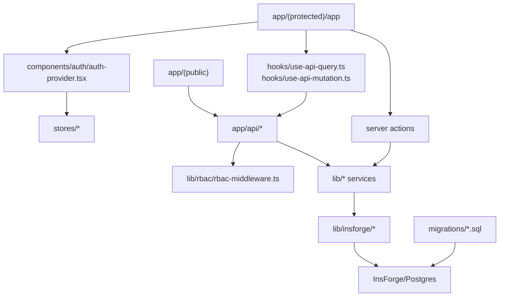

# ADR 000: Current System Boundary And Runtime Shape

## Status

Accepted.

This ADR describes the system shape currently implemented in the repository. It is not a target architecture for unbuilt infrastructure.

## Context

MetricMind is a Next.js BI application with governed, AI-assisted analytics. The current codebase combines UI, route handlers, service logic, and database access in one app repository.

The app already has clear internal boundaries:

- Public and protected App Router pages under `app/`.
- Thin API route handlers under `app/api/`.
- Domain services under `lib/`.
- Client state stores under `stores/`.
- Shared UI components under `components/`.
- SQL migrations under `migrations/`.

Future contributors need a stable mental model for where changes belong without inventing services, queues, deployment targets, or connector behavior that is not checked in.

## Decision

MetricMind is organized as a modular Next.js application with a server-side service layer and InsForge/Postgres as the application data platform.

The current runtime boundary is:

```text
Browser
  -> Next.js pages and client components
  -> shared client hooks with x-workspace-id
  -> Next.js API routes or server actions
  -> lib/* domain services
  -> InsForge SDK / Postgres tables / read-only RPC
```

The system should keep route handlers thin where practical. Business rules, permissions-sensitive workflows, semantic compilation, ingestion, profiling, and persistence mapping should live in `lib/` modules that can be tested directly.

## Current System Map



## Major Runtime Flows

### Auth And Workspace Bootstrap

```text
middleware.ts protects /app/:path*
  -> components/auth/auth-provider.tsx hydrates /api/auth/session
  -> bootstrapWorkspaceContext() loads /api/workspaces
  -> stores/auth-store.ts keeps workspaceContext
  -> useApiQuery/useApiMutation attach x-workspace-id
```

Important boundary: client workspace state improves UX, but it is not a security boundary. API routes, services, and RLS must remain authoritative.

### Governed Ask Flow

```text
POST /api/ask
  -> withRBAC(viewer)
  -> createQueryPlanner()
  -> loadSemanticRegistry()
  -> AI returns SemanticQuery JSON
  -> validateSemanticQuery()
  -> compileSemanticQuery()
  -> execute_readonly_query RPC
```

The foundational rule is covered in [ADR 001](semantic-layer.md): AI does not generate executable SQL for the governed ask flow.

### Data Source Lifecycle Flow

```text
Data Sources UI
  -> /api/data-sources/upload-csv or server actions
  -> lib/data-sources/service.ts
  -> CSV parsing / profiling / semantic suggestions
  -> lib/data-sources/repository.ts
  -> data source, dataset, profile, row, sync, issue tables
```

The lifecycle decision is covered in [ADR 002](data-source.md).

## Module Ownership

| Area | Primary paths | Notes |
| --- | --- | --- |
| Public pages | `app/(public)` | Landing, demo, login, signup. |
| Protected shell | `app/(protected)/app`, `components/shell` | Sidebar, top bar, app routes. |
| Auth and session | `middleware.ts`, `lib/insforge`, `components/auth` | Cookie-backed session and client hydration. |
| Workspace context | `lib/workspaces`, `stores/auth-store.ts`, `stores/workspace-store.ts` | Workspace id and role flow through client hooks and API routes. |
| RBAC | `lib/rbac/rbac-middleware.ts` | Shared role hierarchy and route wrapper. |
| Semantic layer | `lib/semantic`, `app/api/semantic`, `migrations/20260515120000_semantic-layer-registry.sql` | Registry loading, CRUD-style operations, validation, compilation. |
| Ask/query planning | `app/api/ask/route.ts`, `lib/query`, `lib/ai` | Semantic-query planning and read-only execution. |
| Data sources | `app/(protected)/app/data-sources`, `app/api/data-sources`, `lib/data-sources` | CSV/demo ingestion, profiling, sync metadata, semantic-model creation. |
| UI primitives | `components/ui` | shadcn-style primitives. |
| Tests | `*.test.ts`, `*.test.tsx`, `__tests__` | Vitest with jsdom and Testing Library. |

## Current Non-Goals

These are not implemented as checked-in system boundaries today:

- Separate backend service deployment.
- Separate query-engine service.
- Background worker or queue infrastructure.
- Checked-in CI workflow.
- Checked-in deployment config.
- Checked-in migration runner config.
- Real external warehouse/SaaS connectors.
- Object-storage persistence for original uploaded CSV files.
- Verified credential encryption implementation beyond existing schema fields.

Use `TODO: verify` before documenting any of these as supported.

## Consequences

Benefits:

- Contributors can make most changes in one repository with local tests.
- Domain services are testable without browser automation.
- The semantic compiler and data-source lifecycle can evolve independently of page layout.
- The app can use InsForge/Postgres RLS as a backend isolation layer while still enforcing clear route/service checks.

Trade-offs:

- Long-running work such as large syncs is constrained until worker infrastructure exists.
- Route handlers and services must be kept disciplined so the app does not become route-local business logic.
- Missing deployment and CI config means release procedures must be documented as manual validation until those files exist.

## Safe-Change Guidelines

- Add new user-facing flows under `app/(protected)/app` only when they are authenticated app surfaces.
- Put shared business logic in `lib/`, not inside page components.
- Keep workspace-scoped client requests on `useApiQuery` or `useApiMutation` so `x-workspace-id` is included.
- Do not add direct database calls to client components.
- Keep route handlers responsible for request parsing and response shape; push reusable behavior into services.
- Update this ADR when a real new runtime boundary is added, such as CI, deployment config, workers, queues, or external connector execution.

## Related ADRs

- [ADR 001: Govern Analytics Through SemanticQuery Compilation](semantic-layer.md)
- [ADR 002: Manage Data Sources Through Server-Side Lifecycle Services](data-source.md)

## Open Questions

- TODO: verify the intended deployment target before documenting production topology.
- TODO: verify the intended CI system before documenting automated validation as current behavior.
- TODO: decide whether large data-source syncs will run in a worker, scheduled function, or external job system.
