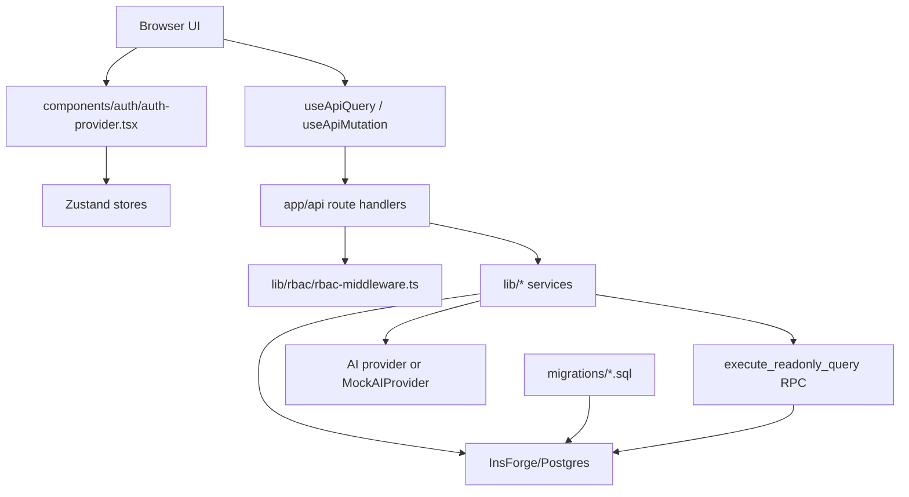
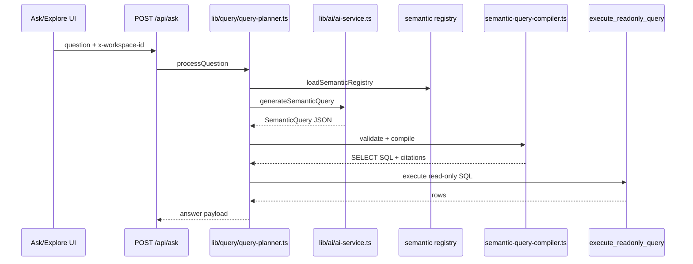

# Architecture

This document describes the architecture currently visible in the repository. For setup and commands, see [development.md](development.md). For security-specific details, see [security.md](security.md). For decision records, see [adr/overview.md](adr/overview.md).

## System Shape



The app is a Next.js App Router application. Public routes live under `app/(public)`. Protected routes live under `app/(protected)/app` and are guarded by `middleware.ts` for `/app/:path*`.

## Runtime Layers

| Layer | Paths | Responsibilities |
| --- | --- | --- |
| Public UI | `app/(public)` | Landing, demo, login, signup |
| Protected UI | `app/(protected)/app` | App shell, dashboards, ask, explore, semantic layer, data sources |
| Client state | `stores/`, `hooks/` | Auth/workspace state, API fetch helpers, conversation/dashboard state |
| API routes | `app/api/` | HTTP boundaries, auth checks, role checks, body parsing |
| Services | `lib/*` | Domain logic, database mapping, query planning, AI, CSV processing |
| Database schema | `migrations/` | Tables, demo data, RLS, RPC helpers |

## Auth And Workspace Bootstrap

1. `middleware.ts` protects `/app` by checking InsForge access/refresh cookies.
2. `components/auth/auth-provider.tsx` calls `/api/auth/session` on mount.
3. `/api/auth/session` uses `lib/insforge/server.ts`, ensures a profile, and attempts to ensure a default workspace.
4. `bootstrapWorkspaceContext()` fetches `/api/workspaces` and updates:
   - `stores/auth-store.ts` with `{ workspaceId, role }`
   - `stores/workspace-store.ts` with available and current workspaces
5. Client API helpers attach `x-workspace-id`.

The persisted auth store intentionally persists only `workspaceContext`; user/session are rehydrated from InsForge/session endpoints.

## API Request Pattern

Most workspace-scoped API routes follow this pattern:

```text
authenticate InsForge user
extract x-workspace-id or workspaceId query param
resolve workspace role
check hasPermission(...)
call a lib service
return JSON
```

Reusable RBAC wrapper:

- `withRBAC` in `lib/rbac/rbac-middleware.ts`
- Used by `/api/ask`

Many older route handlers inline the same checks. When changing a route, prefer consolidating duplicated auth/role logic if the edit stays focused.

## Semantic Query Pipeline

The central governed analytics path is:



Rules that matter:

- `lib/ai/ai-service.ts` prompt says to return SemanticQuery JSON only.
- `parseSemanticQueryResponse` rejects invalid JSON-like responses.
- `lib/semantic/semantic-query-validator.ts` validates metric/dimension/filter references and role-gated PII access.
- `lib/semantic/semantic-query-compiler.ts` is the only approved source of generated analytics SQL.
- `execute_readonly_query` in `migrations/20260514080841_initial-schema.sql` rejects mutating SQL and applies a timeout.

See [adr/001-semantic-layer.md](adr/001-semantic-layer.md) for the decision record behind this contract.

## Data Sources Architecture

Current rich Data Sources flow:

```text
app/(protected)/app/data-sources/page.tsx
  -> getDataSourcesPageData()
  -> components/data-sources/data-sources-page.tsx
  -> /api/data-sources/upload-csv or server actions
  -> lib/data-sources/service.ts
  -> lib/data-sources/repository.ts
  -> InsForge/Postgres tables
```

Key modules:

- CSV parser: `lib/data-sources/csv/parse-csv.ts`
- Schema inference: `lib/data-sources/csv/infer-schema.ts`
- Row normalization: `lib/data-sources/csv/normalize-rows.ts`
- Profiling: `lib/data-sources/profiling/profile-dataset.ts`
- Semantic suggestions: `lib/data-sources/profiling/semantic-suggestions.ts`
- Repository mapper: `lib/data-sources/repository.ts`
- Server actions: `app/(protected)/app/data-sources/actions.ts`

There is also an older `lib/data-sources/data-source-service.ts` used by `app/api/data-sources/route.ts`. Check which endpoint a UI flow actually calls before modifying either service.

See [adr/002-data-source.md](adr/002-data-source.md) for the data-source lifecycle decision record.

## Semantic Layer Architecture

Canonical semantic registry tables were introduced by `migrations/20260515120000_semantic-layer-registry.sql`:

- `semantic_models`
- `semantic_entities`
- `semantic_dimensions`
- `semantic_measures`
- `semantic_relationships`
- `metrics`
- `glossary_terms`

Runtime modules:

- `lib/semantic/semantic-loader.ts`: loads registry data.
- `lib/semantic/semantic-layer-service.ts`: CRUD-style semantic operations.
- `lib/semantic/metric-resolver.ts`, `dimension-resolver.ts`, `join-graph.ts`: resolution helpers.
- `lib/semantic/citation-builder.ts`: compiler citation metadata.

## Database And Migrations

The repository contains raw SQL migration files but no checked-in migration runner configuration. Treat migration execution as environment-specific.

Important migration groups:

- `20260514080841_initial-schema.sql`: base schema, demo schema, RLS, read-only RPC.
- `20260515062000_fix-workspace-bootstrap-rls.sql`: workspace bootstrap RLS repair.
- `20260515120000_semantic-layer-registry.sql`: canonical semantic registry.
- `20260515193000_backfill-demo-semantic-definitions.sql` and `20260515194500_repair-demo-semantic-backfill.sql`: demo semantic backfills.
- `20260516090000_data-sources-backend.sql`: data source backend tables, CSV row storage, sync, credentials, RLS.
- `20260516110000_data-sources-review-fixes.sql`: data-source policy fix.

## Mock, Demo, And Fallback Data

- `app/(public)/demo/page.tsx` is intentionally hardcoded demo behavior.
- `lib/mock-data/` holds deterministic sample data for tests and public demo surfaces only.
- Production app modules should not import `lib/mock-data` directly. The smoke test in `__tests__/smoke/no-mock-data-imports.test.ts` enforces this across protected pages, shared components, and `lib/` service code.
- `components/data-sources/data-sources-page.tsx` renders empty real workspace state when no backend page data is available; it does not hydrate production UI from sample records.

## Known Architecture Gaps

- No checked-in `.github/` CI workflow.
- No deployment config such as `vercel.json`.
- No separate `typecheck` script.
- AI provider env vars are present in `.env.local.example`, but current provider selection is driven by workspace database config plus mock fallback. TODO: verify intended env support.
